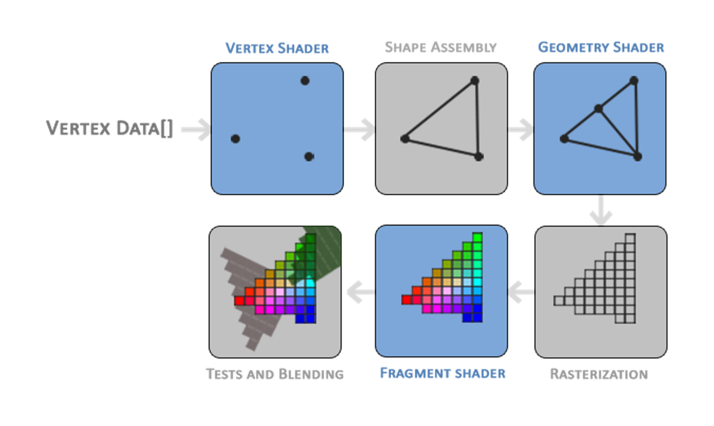
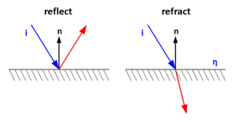
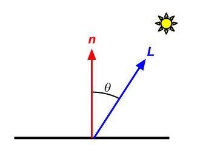
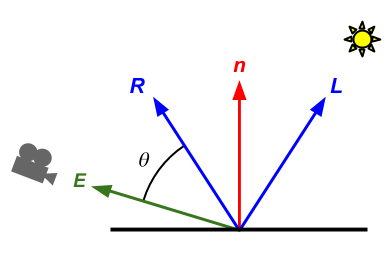

# Shader Lab

Welcome to the Shader Lab! You just finished the VAO/VBO lab which focused on sending vertex data to the GPU in the form of attributes, now it's time to learn how to use that data to actually render images!

A shader is just a program that gets run on the GPU.

This could handle anything from camera coordinate conversion and perspective transformation to computing the phong illumination model or even implementing a post processing blur effect! They are super powerful and general tools!

This lab will teach you the basics of shaders. This includes…
- Handling input and output to and from shaders.
- The differences between Vertex and Fragment shaders.
- How to write a shader in GLSL.
- How to compile and use a shader once it's written.

Let's get Started!

## 1. Overview of Types of Shaders

There are two main types of shaders you will be writing for this lab: Vertex and Fragment Shaders.

<p align="center">

</p>

 ### 1.2. Vertex Shaders

If you remember from the OpenGL pipeline as it was discussed in class, the Vertex Shader is the first computation the GPU does on the input data. 

To connect this to your experience so far, this means the Vertex Shader acts directly on the VAO/VBO data, performing any number of pre-processing transformations and computations directly on the Vertex Data.

### 1.3. Fragment Shaders

The Fragment Shader receives input from the Vertex Shader and deals with the final computation of the displayed color for every pixel in the image. This is where the majority of fancy realtime effects get implemented.

A fragment is the per-pixel collection of information needed to produce the final color. Remember back to the lab05_light where you had a 2D array of intersection data and used that to produce a color? That was the basically the same thing as a fragment shader!
 
## 2. Implementation

### 2.0. Note On Stencil


### 2.1. GLSL
We will use the Graphics Library Shading Language (GLSL for short) to write shaders. GLSL’s syntax is very similar to C/C++, and is the primary shading language for OpenGL.  A GLSL program is a collection of individual shaders that instructs OpenGL how to draw geometry. 

[we might not need to mention the following sentence, although we should mention how GLSL fits in the overall pipeline in this lab. Since the GPU only runs one program at a time, we need to specify which program to use prior to drawing shapes.] 

[hard to debug, we recommend visually debug?? section on debugging?]

Common GLSL data types include:
- `float, int, bool`
- `vec2, vec3, vec4`
- `mat2, mat3, mat4`

Also supported are:
- arrays using `[]` syntax like C
- structs!

You can write functions.
```
returnType functionName(argType argName, ... etc.) {

}
```

You can use predefined functions. This includes...
- `sin`, `cos`, `tan`, etc...
- `pow`, `exp`, `log`, etc...
- `cross`, `dot`, `inverse`, `transpose`, etc...

[A full list from the official reference card](https://www.khronos.org/files/opengl45-quick-reference-card.pdf#page=11)

though its uhh, a bit much.

### 2.2. Using the ShaderLoader

To start off we are going to have you use our shader loader to load, compile, and link the vertex and fragment shader files.

This process is fairly lengthy, simply look at the length of this file and we feel this does not provide you much interesting learning opportunities. For these reasons we have provided you with the ShaderLoader class which takes in the filepaths to the vertex and fragment shader, relative to the top-level project directory, and does all this compilation for you. The returned programID is used with other OpenGl functions to activate and deactive the shader for drawing.

> Task 1: call createShaderProgram and set m_programID to the returned the value.


### 2.3. Shader Input and Output
As shaders are isolated onto the GPU, moving data between the main code file and the shader is not an intuitive process.
There are 3 main ways to make data available for use within a shader.

#### 2.3.1. Vertex attributes: the "location" keyword
To read in data from a VAO all we need to do is specify outside of the main function using the following syntax…
```
layout(location = [index]) in [data_type] [variable_name];
```
- [data_type]: Can be any of the GLSL data types (float, vecX, etc) but should match the data specified in the VAO.
- [variable_name]: The name this data is bound to within the shader.
- [index]: The index is how you indicate which VAO you would like to associate with this variable. Recall when defining a VAO attribute you used the function glVertexAttribPointer and glEnableVertexAttribArray each of which had the first argument called "index." We simply reuse the index of the desired attribute.
 
> Task: Specify the position and normal in variables in the default.vert shader file. Look at lines XXX-XXX in file "xxxx.cpp" to identify which index corresponds to which data.

#### 2.3.2. Data Passed from V to F shaders: the "in" and "out" keywords
 
In GLSL, we specify data flow between shaders by manually creating input and output variables for each shader. As such, if we wish to pass data from the vertex shader to the fragment shader, we must specify an output variable for the vertex shader and an input variable for the fragment shader. To have OpenGL link the two, having the same variable name and data type is a necessity. The following syntax shows how these variables can be defined:
```
//Within the vertex shader
out [data_type] [variable_name];
```
```
//Within the fragment shader
in [data_type] [variable_name];
```
After the declaration of these variables, we can treat them as we would any other member variable for the shader.

> Task: Create an input/output link to pass the vertex normal data from the vertex shader to the fragment shader.

<details> <summary> Note on interpolation: </summary>
You may wonder how there can be data passed from vertex to fragment shaders when there is almost always a different number of vertices and fragments. Behind the scenes, an interpolation is occurring on that vertex value. The resulting fragment value uses barycentric coordinates of the relevant triangle it is composed of to weight each of the 3 vertex variable values in an interpolation to produce a single output value for each fragment. (should include image of VAO lab triangle to aid in explanation as they would remember the smooth color gradients from that lab)
</details>
 
#### 2.3.3. Uniforms: the "uniform" keyword
So far, we have learned about passing data that is unique to each vertex or fragment. What if we want to pass in a single piece of data that applies to all fragments/verticies? The answer is to use something called a uniform variable. These can be defined in either vertex or fragment shaders using the following syntax:
```
uniform [data_type] [variable_name];
```
Because this variable is sent from the CPU (similar to the layout variable), we need a way to tell OpenGL what data we want to use. Unfortunately, depending on the data type, the function signature differs slightly. The generic format of the call is:
```
//Within the CPU code
glUniform_(GLuint location, GL_ var1, GL_ var2, …)

//For a matrix we use a different syntax
glUniformMatrix_(GLuint location, GL_ var1, GL_ var2, …)
```
The underscore is replaced by characters defining the size and type of data being passed in. For a full list of calls for various types, refer to this documentation.
The first argument to this function is the location of the uniform within the OpenGL state machine. Unfortunately for us unless we specify this within the shader this value is assigned at runtime. To get this value we need to use the function, `glGetUniformLocation`.
```
GLint glGetUniformLocation(GLuint program, const GLchar *name)
```
Breaking this down:
- program: shader program ID. This is generated by the resource loader as a unique identifier for the compiled shader program.
- name: name of variable to find location of. For example if I have a uniform called cpu_color that I want to find the location of, I would use `"cpu_color"` for this argument.

The returned value is -1 if the specified name can not be found. Otherwise we can pass the output GLint directly into glUniform_ as the location parameter.
 
> Task: Create a uniform variable in the vertex shader to store a model matrix and pass in the model matrix member variable (m_model) we have created for you.

<details> <summary> Hint on matrix syntax: </summary>
The function call contains a few more parameters than may be expected. Namely these 3: GLsizei count, GLboolean transpose, and const GLfloat *value. The first specifies how many matrices we are passing in (always 1 unless we are dealing with an array of matrices). The second is a boolean as to whether we need to transpose this matrix. The third is a pointer to the first element of the matrix you wish to send. Unlike what would be expected however, the matrix must be in column major order. Luckily, glm stores its matrices in this format already for you! So to get the value to pass in you can write:
```
&matrix[0][0] //Pointer to first element of glm matrix
```
</details>
 
## 3.0 Vertex Shaders
As the name implies, a vertex shader is a program that runs on the gpu which operates on each vertex of the VAO it is processing. As such, it is used for per-vertex calculations and at this stage of the pipeline, rasterization has not yet occurred. 

In this section you will do these per-vertex operations starting with transformations you have seen before!
### Transformations in a Vertex Shader
If you recall, we typically need 3 matrices to define our full transformation: Model, View, and Projection matrices. In the parsing lab, you calculated model matrices for each shape and a view matrix for the camera based on its position, look, and up vectors. In the realtime 1 algos you have seen how a projection matrix can be calculated to morph a view frustum into a cubic space. 

[image showing relationship as follows: 
(Object Space) —- Model Matrix --–> (World Space) —- View Matrix --–> (Camera Space) —- Projection Matrix --–> (Clip Space)]

The matrices should be applied in the following order: model -> view -> projection (remember the notes on matrix order of application) to fully convert from object to clip space

> Task: Using the same method as for the model matrix, pass in m_view and m_projection into the vertex shader as uniforms.
> Task: Using the model and view matrices, transform the vertex position and vertex normal data to camera space and then pass the transformed data to the fragment shader using the in/out keywords.

### Default Outputs
There is one type of shader output we have not discussed yet, they are called "predefined outputs" and are always implicitly defined by OpenGL. We only care about `gl_Position` in this case but you can read about the others here.

gl_Position is a vec4 that represents the vertex's output position in clip-space. 

> Task: Set gl_Position to the result of applying the MVP (model, view, projection) transformation to the vertex position.

## 4.0 Fragment Shaders
The fragment shader on the rasterized data. Because the data has been rasterized all the data has been *fragmented* from per-vertex data to per-pixel data. The fragment shader computes the final display color of a given pixel.

### "Default" Outputs

Because OpenGL is a consistent and well designed system, just like how there was a `gl_Position` output for the Vertex shader, there is a parallel `gl_FragColor` output defined for the fragment shader!...

not...

Instead, in modern OpenGL you need to manually define an arbitrary output vec4. This output is then detected by OpenGL and is assumed to be the final output pixel. While the variable name does not have any restrictions on it, we recommend you still name it gl_FragColor for readability. For the purposes of the lab this works fine, of course there is much more control and detail to this then presented.

<details> <summary> More Info On Fragment Shader Outputs </summary> 
https://www.khronos.org/opengl/wiki/Fragment_Shader#Outputs
</details>

> Task: Manually add a vec4 named gl_FragColor as an output to your fragment shader. For now set it to be a value of vec4(1.0) in the fragment shader main function 

(you should now see a white circle, if you don't it's time to debug)
 
> Task: Use your normal input variable’s x, y and z components to represent r, g, and b components of your output FragColor. 

As a hint, the following pattern is allowed in glsl: `varVec4 = vec4(varVec3, 1.0)`
 
##  5.0 Phong Lighting

<p align="center">

</p>
(temp image)

Alright now that we have gone over the basics of Vertex and Fragment shaders lets implement a basic version of the Phong Illumination model. This section will be a set of tasks which you will need to complete using the previous information in the lab! Make sure to reference it if you get stuck.

### Ambient Lighting
> Task: Create a uniform vec4 in the fragment shader to hold the RGBA color of your sphere (m_color)
 
> Task: Create a uniform float in the fragment shader to hold the ambient intensity
 
> Task: Add an ambient lighting component by multiplying the object color and ambient intensity and set this equal to your FragColor
 
### Diffuse Lighting

<p align="left">

</p>

Diffuse Contribution = $K_d(n ⋅ L)$
- $K_d$: Diffuse Coefficient
- $n$: Surface Normal
- $L$: Vector to Light
 
> Task: Create a uniform vec4 in the fragment shader to hold the camera space light position (m_lightPos)
 
> Task: Calculate the light direction vector by subtracting the camera space fragment position from camera space light position
 
> Task: Calculate the diffuse intensity as a float by using the [dot](https://registry.khronos.org/OpenGL-Refpages/gl4/html/dot.xhtml) function in GLSL. Make sure to [normalize](https://registry.khronos.org/OpenGL-Refpages/gl4/html/normalize.xhtml) the light and normal vectors before performing this operation!
 
> Task: Integrate the diffuse intensity into your fragment color by calculating a total intensity value given by: ambient + diffuse and multiply this by your object color.
 
### Specular Lighting

<p align="left">

</p>


Specular Contribution = $K_s(R ⋅ E)^N$
- $K_s$: Specular Coefficient
- $R$: Reflected Light Vector
- $E$: Vector to Camera
- $N$: Specular Exponent
 
> Task: Calculate the reflected light vector R in the fragment shader using [reflect](https://registry.khronos.org/OpenGL-Refpages/gl4/html/reflect.xhtml). 

> Task: Calculate the camera vector E by using the fragment position in camera space. Hint: what is the camera’s position in camera space?

> Task: Calculate the specular intensity using [dot](https://registry.khronos.org/OpenGL-Refpages/gl4/html/dot.xhtml) and our two vectors we calculated as well as the GLSL exponential function [pow](https://registry.khronos.org/OpenGL-Refpages/gl4/html/pow.xhtml). Feel free to select your own value for the specular exponent.

$phong color = object color*(K_a + K_d * (n·L) + K_s(R ⋅ E)^N)$
